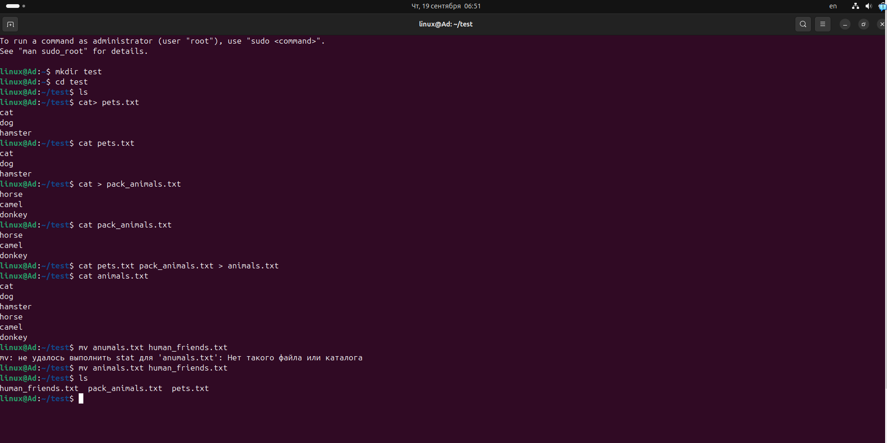
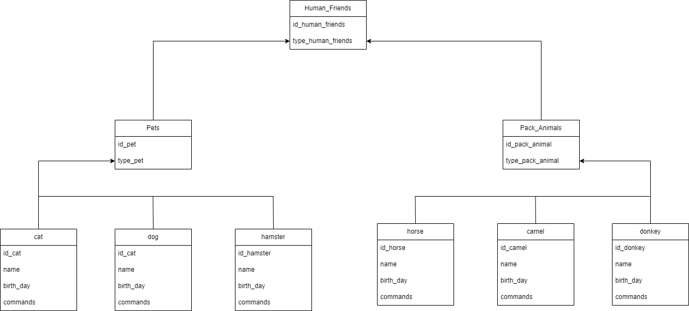

Ход выполнения:
1. Ход выполнения 1 пункта

2. Ход выполнения 2 пункта

3. Подключить дополнительный репозиторий MySQL. Установить любой пакет
из этого репозитория:
    wget -c https://dev.mysql.com/get/mysql-apt-config_0.8.30-1_all.deb
    sudo dpkg -i mysql-apt-config_0.8.30-1_all.deb
    sudo apt update
    sudo apt install mysql-server

4.  wget -c http://ftp.ru.debian.org/debian/pool/main/n/nginx/nginx_1.22.1-9_amd64.deb

    sudo dpkg -i nginx_1.22.1-9_amd64.deb

    sudo apt-get install -f

    sudo dpkg -r nginx nginx-common

5.   Список команд из истории

6. Диаграмма

7. 
